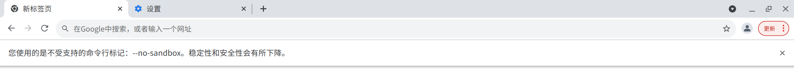

# Deepin 玲珑应用 相关的常见问题及解决方案
## 目录
1. [如何安装玲珑应用](#如何安装玲珑应用)
2. [Deepin无法安装玲珑应用](Deepin无法安装玲珑应用)
    * 没有安装玲珑环境
    * 浏览器版本太旧
3. [右键菜单中无法卸载玲珑应用](#右键菜单中无法卸载玲珑应用)
4. [从玲珑安装的Chrome每次打开都有警告与更新提示](#从玲珑安装的chrome每次打开都有警告与更新提示)
## 如何安装玲珑应用
* 访问玲珑的官方网站https://store.linglong.dev  
* 单击`install`  
* 在弹出的对话框中，选择`打开 odg-open`  
* 等待安装完成  
## Deepin无法安装玲珑应用
### (1)没有安装玲珑环境
**Deepin V20**  
使用`uname -r`查看内核版本。  
```
uname -r
```
输出如下：  
```
5.10.101-amd64-desktop
```
内核版本要求>=4.19。  
*x86架构4.19内核需要开启user namespace。*  

使用apt安装玲珑环境：  
```
sudo apt install linglong-builder \
                 linglong-box \
                 linglong-dbus-proxy \
                 linglong-bin \
                 linglong-installer
```
**Deepin V23**  
已预装玲珑环境,无需安装。  
### (2)浏览器版本太旧
从[Google Chrome](https://www.google.cn/intl/zh-CN/chrome/)官网下载最新版本的Chrome浏览器。  
  
之后回到[如何安装玲珑应用](#如何安装玲珑应用)  
`不知道为什么，我使用相同内核版本的Firefox，却没有安装成功`
## 右键菜单中无法卸载玲珑应用
使用`ll-cli list`查看已安装的玲珑应用。  
```
ll-cli list
```
复制将要卸载的应用的`appId`。  

使用`ll-cli uninstall`+`appId`卸载玲珑应用。  
如下：  
```
ll-cli uninstall org.deepin.calculator
```
默认卸载最高版本，可以通过`appid`后附加对应版本号卸载指定版本。  
如下：  
```
ll-cli uninstall org.deepin.calculator/5.1.2
```
该命令执行成功后，该玲珑应用将从系统中被卸载掉。
## 从玲珑安装的Chrome每次打开都有警告与更新提示
  
  
跳转到以下目录，编辑`google-chrome.desktop`文件，删除其中的`--no-sandbox`参数。  
```
cd persistent/linglong/entries/share/applications
sudo vim google-chrome.desktop
```
在**Exec**所在行中，删除参数“ --no-sandbox”  
  
增加参数` --disable-background-networking`  
也就是由：  
```
Exec=ll-cli run cn.google.chrome --exec "/opt/apps/cn.google.chrome/files/google-chrome --no-sandbox" %U
```
变成：  
```
Exec=ll-cli run cn.google.chrome --exec "/opt/apps/cn.google.chrome/files/google-chrome --disable-background-networking" %U
```
